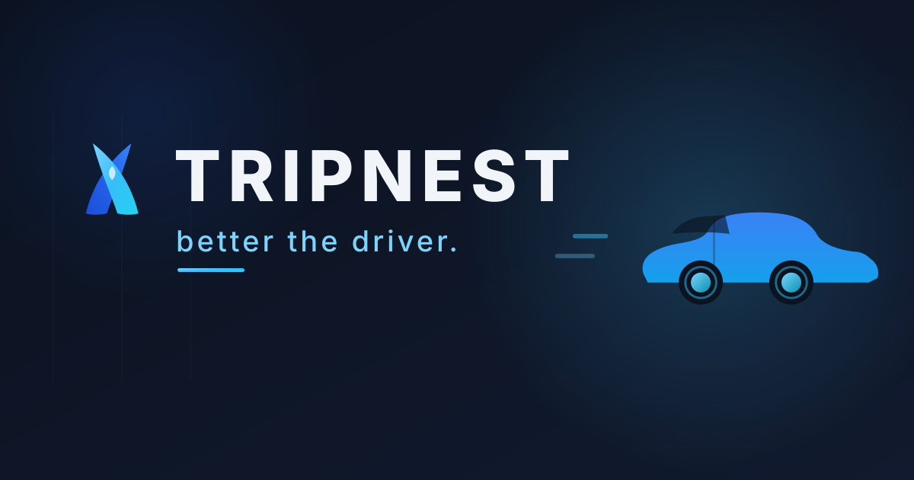

# TripNest



> **Live app:** [tripnest-puce.vercel.app](https://tripnest-puce.vercel.app)

<p align="center">
  
  
  
  
  
  
</p>

TripNest is a **mobile-first ride-booking and event-transport marketplace**. Customers
pre-order drivers for **scheduled rides, airport pickups, event travel, and shared rides**,
while drivers go online and accept or reject requests in real time.

---

## Table of Contents

- [Features](#features)
- [Tech Stack](#tech-stack)
- [Project Structure](#project-structure)
- [Getting Started](#getting-started)
- [Multi-Device Testing](#multi-device-testing)
- [Build & Deploy](#build--deploy)
- [Security](#security)
- [Roadmap](#roadmap)
- [Leadership](#leadership)
- [Documentation](#documentation)

---

## Features

**Client experience**
- Book scheduled rides, airport transfers, event travel, and shared rides
- Live dashboard with realtime request status updates
- Driver map with nearby and online/offline status
- Inbox chat for rider–driver communication
- Favorite drivers for repeat bookings
- Payment methods wallet

**Driver experience**
- Online/offline availability toggle with realtime routing
- Accept / reject ride requests live
- Trips history and Inbox chat
- Profile setup with Get-a-Ride mode switch

**Platform**
- Role-based authentication (client / driver)
- Realtime data via Firebase Firestore
- Distance-based pricing
- Security hardening: SMS verification, 2FA, audit logging, validation, and IP blocklist

---

## Tech Stack

| Layer      | Technology                                                                     |
| ---------- | ------------------------------------------------------------------------------ |
| Framework  | [Next.js 15](https://nextjs.org) (App Router) + [React 19](https://react.dev)  |
| Language   | [TypeScript](https://www.typescriptlang.org)                                   |
| Styling    | [Tailwind CSS](https://tailwindcss.com) — custom design system (deep navy + electric blue `#2563EB`, glassmorphism) |
| Animation  | [Framer Motion](https://www.framer.com/motion) — spring micro-interactions     |
| Backend    | [Firebase](https://firebase.google.com) — Auth, Firestore, Storage             |
| Maps       | [MapLibre GL](https://maplibre.org)                                            |
| Fonts      | Sora (display) + Inter (body) via `next/font`                                  |
| Auth       | Firebase Auth + Supabase callback handling                                     |

---

## Project Structure

```text
app/                    Routes (App Router)
  page.tsx              Landing / role select
  signup/client         Client signup
  signup/driver         Driver signup
  auth/                 Auth callback handling
  client/               Client dashboard, inbox, favorites, wallet
  driver/               Driver dashboard, inbox, trips, profile
  events/               Events listing + book-to-event
  airport/              Airport transfers + flight board
components/             UI primitives, layout, providers, ride card, brand
hooks/use-rides.ts      Realtime ride subscriptions
lib/                    Firebase client, auth, Firestore, types,
                        ride & favorites services, utils
legacy/                 Original vanilla-JS prototype (Mark 0.1), kept for reference
PRD.md                  Product Requirements Document
```

---

## Getting Started

### Prerequisites

- **Node.js** 18.18 or later

### Installation

```bash
npm install
```

### Environment Variables

Environment variables live in `.env.local` (already configured for the Firebase project):

```text
NEXT_PUBLIC_FIREBASE_API_KEY=...
NEXT_PUBLIC_FIREBASE_AUTH_DOMAIN=...
NEXT_PUBLIC_FIREBASE_PROJECT_ID=...
NEXT_PUBLIC_FIREBASE_STORAGE_BUCKET=...
NEXT_PUBLIC_FIREBASE_MESSAGING_SENDER_ID=...
NEXT_PUBLIC_FIREBASE_APP_ID=...
NEXT_PUBLIC_FIREBASE_MEASUREMENT_ID=...
```

### Run the development server

```bash
npm run dev
```

The dev server binds to `0.0.0.0` so other devices on your WiFi can connect. It runs on
port 3000 by default (or pass `-- -p 4173`). Open `http://localhost:3000`.

---

## Multi-Device Testing

Test the live driver ↔ customer flow on two phones:

1. Connect your computer and both phones to the same WiFi.
2. `npm run dev` on the computer.
3. Find your computer's WiFi IPv4 address (`ipconfig` on Windows → `IPv4 Address`, e.g. `192.168.8.103`).
4. On **both phones**, open `http://YOUR_COMPUTER_IP:3000`.
5. **Phone A:** tap *I'm a Client* → sign up → book a ride.
6. **Phone B:** tap *I'm a Driver* → sign up → toggle **availability ON**.
7. The request appears on the driver's phone **live**. Accept it → the client's status flips
   to *Accepted* in real time. Mark complete → the client can favorite the driver.

Because data is stored in Firebase Firestore (not local memory), the two phones do **not** need
to be on the same network in production — only the local dev server does. Deploy (e.g. Vercel) to
test across networks.

---

## Build & Deploy

```bash
npm run build && npm start
```

The app is production-ready for deployment on any platform that supports Next.js, such as
[Vercel](https://vercel.com).

---

## Security

Authentication is handled by Firebase Auth (email/phone) with role-based access for clients and
drivers. The codebase includes security hardening for verification, auth callbacks, crypto,
SMS, payment flows, 2FA, audit logging, input validation, and an IP blocklist.

Production deployments **must** keep Firebase Security Rules locked down so users can only
read and write their own data.

---

## Roadmap

Ratings, push notifications, live GPS tracking, distance-based matching, surge pricing, admin
dashboard, and PWA support — see [PRD.md](PRD.md) §11 for the full roadmap.

---

## Leadership

- **Andrew Dames** — Chief Executive Officer / Chief Financial Officer
- **Raymond Ndungu** — Chief Financial Officer / Chief Technology Officer

---

## Documentation

- [PRD.md](PRD.md) — full product spec and roadmap
